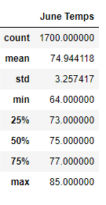
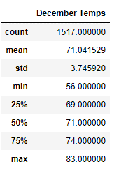

# Surfs_Up - Module 9 Challenge

## Overview of the Analysis

The overview of this analysis was to review weather data and prepare a business plan in order to entice an investor, W. Avy to provide financial backing for a surf and shake shack that we are interested in opening in Hawaii.  By using SQLite, specifically SQLAlchemy in connection with Pandas , VS Code and Jupyter Notebook, we were able to query the data from a specific source file and provide cohesive results in the form of Pandas DataFrames.


## Results

*** 

* Weather Results for June


The weather results for June were found by using the session.query function which retrieved the temperatures from our data file.  We first created the variable to store the results and then filtered by extracting the month from the data and the measurements for that particular month.  As the 6th month was June, we used 6 as shown in the code below. 

```

june_results = session.query(Measurement.date, Measurement.tobs).filter(extract("month", Measurement.date) == 6)

```
After querying the results, we then added them to a list using the .all() function as shown below.  
```
june_results = session.query(Measurement.date, Measurement.tobs).filter(extract("month", Measurement.date) == 6).all()

```
After adding the data to a list, we then created a DataFrame to hold the specific data we were looking for.  The .describe() function provided the table below which details the temperatures for June.  It appears that based on the data, the average temperature was 75 degrees.  The highest temperature indicated as max appears to be 85 and the lowest temperature appears to be 64.  




* Weather Results for December 

The weather results for December were found using a similar query to that of the one we used for June, except that we changed the month to 12 as December is the 12th month as shown in the code below.   

```

dec_results = session.query(Measurement.date, Measurement.tobs).filter(extract("month", Measurement.date) == 12).all()

```
As shown in the DataFrame table below, the average temperature for December appears to be 71 degrees.  The max temperature appears to be 83 and the min or lowest temperature is only 56 degrees.  




## Summary

In conclusion, it appears that the weather data provided for the temperatures in June and December are not that different aside from December being slightly cooler.  It appears that the average temperatures for June and December only have a difference of three degrees.  The most significant difference was between the min temperature which was 64 degrees for June and 56 degrees for December.  In order to better gauge the reliability of the weather in Hawaii, I think it would be best to also query the precipitation as we did in the module.  I think it would also be beneficial to research the probability of severe storms and tsunami’s during specific months like June and December. 
